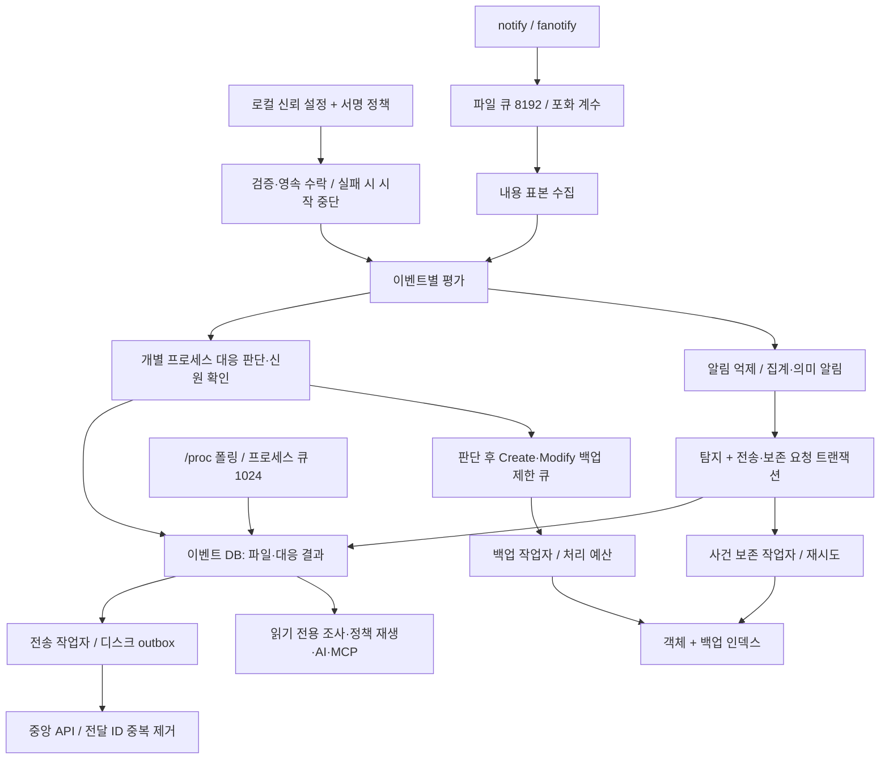

# Argos AI Security 아키텍처

기준: **v0.4.0, 2026-09-27**. 이 문서는 현재 코드의 구성과 신뢰 경계를 설명한다. 제품의 장기 목표는 [요건서](REQUIREMENTS.md), 실행한 시험과 미검증 범위는 [검증 기록](PLATFORM_VALIDATION.md)을 참고한다.

## 컴포넌트와 실행 단위

Rust 워크스페이스는 12개 크레이트로 구성된다. `argos-agent`, `argos-central`, `argos`, `argos-vault`가 데몬·중앙 서버·CLI·보관 서버 실행 파일이다.

| 크레이트 | 현재 역할 |
| --- | --- |
| `argos-common` | 이벤트·프로세스 신원·내용 표본·탐지·설정 타입 |
| `argos-sensor` | 기본 notify 또는 Linux fanotify 파일 센서, `/proc` 프로세스 폴링, 센서 상태 계수 |
| `argos-detect` | 센서별 점수, 승인 작업, 미끼 파일, 선택적 다중 시간창 집계·내용 샘플링 |
| `argos-storage` | SQLite 이벤트·탐지·대응 감사, 읽기 전용 근거 조회, 중앙 전송·사건 보존 대기열 |
| `argos-policy` | Ed25519 정책 검증, 영속 버전·대상·유효기간 검사, 승인 롤백, 과거 이벤트 재생 |
| `argos-response` | 프로세스 신원을 확인한 종료, 명시적 관리 연결을 허용하는 IPv4/IPv6 격리 |
| `argos-recovery` | SHA-256 객체 백업, 정상본 판정·복구 시험, 독립적인 사건 보존 참조 |
| `argos-brain` | 설정한 Anthropic/Ollama 제공자에 조회 근거를 전달하는 AI 설명·질의 |
| `argos-agent` | 설정·정책 활성화, 수집·판단·대응·저장 연결, Linux 설정 의미 분석, 작업자·보호 상태 관리 |
| `argos-central` | axum API, 관리자/에이전트 인증 분리, 탐지 수집·중복 제거·생존 상태 대시보드 |
| `argos-vault` | 별도 호스트의 추가 전용 보관 API, 역할별 토큰과 Ed25519 수신증명 |
| `argos-cli` | 상태·근거·정책 조회, 재생, 복구·격리, AI·조회형 MCP·HTML·증거 패키지 |

구체적인 함수와 파일 위치는 [소스 코드 안내](SOURCE_CODE_ANALYSIS.md)에 정리한다.

## 시작과 정책 신뢰

로컬 `argos.toml`은 감시 경로, 센서, 저장소, 중앙·AI 연결과 정책 신뢰 키를 정한다. 서명 정책을 설정하면 에이전트는 파일을 한 번 읽어 **같은 바이트를 검증하고 파싱**한다. 정책 ID·키 ID·버전·유효기간·호스트/그룹 대상과 탐지·대응 설정을 검사하고, 수락 원문·설정·최대 버전·감사를 정책 상태 DB의 같은 트랜잭션으로 저장한다. 검증이나 영속 저장에 실패하면 시작을 중단한다.

동일 버전·동일 해시는 재시작 시 허용하며, 다른 바이트의 동일 버전과 낮은 버전은 거부한다. 이전 설정으로 돌아갈 때도 저장된 이력·승인 근거를 참조하는 **더 높은 새 버전**이 필요하다. 실행 중 정책 기간을 벗어나면 자동 차단을 중단하고 보호 저하를 표시한다. 수락한 탐지 설정은 유지하며, 유효한 정책으로 재시작해야 자동 차단을 다시 활성화할 수 있다.

정책 상태 DB의 `active`는 마지막으로 수락한 설정이다. 이후 센서 시작 성공이나 사건 당시 실제 실행 정책의 증명은 아니다. 신뢰 설정·상태 전체를 수정할 수 있는 로컬 관리자/root와 디스크 전체 롤백은 이 경계 밖이다. 서명 정책을 설정하지 않은 로컬 설정 실행도 지원한다. 중앙 정책 자동 배포·실행 중 교체·인증서 기반 신뢰는 후속 범위다. 세부 조건은 [정책 신뢰와 사전 검증](FEATURE_POLICY.md)을 참고한다.

## 이벤트와 작업자 흐름

파일 이벤트는 수집 당시 PID와 가능한 프로세스 맥락을 담는다. 에이전트는 내용 표본을 보강한 뒤 `DetectionEngine::evaluate()`를 호출한다. 매 이벤트의 대응 후보 판단은 `alert` 반환 여부와 독립적이다. 자동 대응은 이벤트 DB 기록과 전체 파일 백업보다 먼저 실행하고, 그 결과를 별도 감사 행으로 저장한다. Linux 설정 의미 분석도 이 경로에서 실행되지만 직접 종료를 지시하지 않는다.

파일 이벤트와 대응 감사는 각각 저장한다. **탐지 한 건과 그 중앙 전송·사건 보존 요청**은 같은 이벤트 DB 트랜잭션으로 저장한다. 전체 수집·대응·백업을 하나의 트랜잭션으로 묶지는 않으므로 실제 조치 후 감사 저장이 실패할 수 있고, 이 실패는 로그로 확인해야 한다.

| 경로 | 상한·실패 처리 |
| --- | --- |
| 센서 → 이벤트 처리 | 파일 8192건·프로세스 1024건 큐. 포화·센서 오류·커널 넘침을 계수하며 이미 누락된 이벤트를 복원하지 않음 |
| 백업 | 기본 256건 메모리 큐와 별도 스레드. 시작 베이스라인도 작업자에서 수행. 기본 파일 상한 50 MiB·평균 논리 파일 바이트 예산 10 MiB/s, 누락·실패·크기 제외·지연 계수 |
| 사건 보존 | 이벤트 DB에 최대 10,000건 영속 요청. 별도 스레드가 재시도하며 초과 시 탐지는 유지하고 보존 요청 누락을 영속 계수 |
| 중앙 보고 | 디스크 outbox와 전용 HTTP 스레드. 성공 ACK 후 삭제, 전달 ID로 중앙 중복 제거. 대기열을 임의 폐기하지 않으므로 장기 단절 시 디스크 용량 관리 필요 |

백업 예산은 한 파일의 버스트를 허용한 뒤 다음 작업을 지연하는 방식이다. 실제 디스크 전체 I/O나 CPU를 제한하는 자원 제어기는 아니다. 내용 샘플링·의미 분석·로컬 DB·프로세스 대응에는 동기 작업이 남아 있으므로 별도 작업자만으로 일정 처리 지연을 보장하지 않는다. 30초 생존 신호와 로컬 상태 파일에 수집·분석·백업·보존·전송 상태를 기록한다. 자세한 실패 의미는 [운영 신뢰성](FEATURE_RELIABILITY.md)에 있다.

## 탐지와 대응 경계

기본 시간창은 10초, 탐지 임계치는 40점, 차단 임계치는 80점이다. **자동 차단은 기본 비활성**이다.

| 기본 행위 점수 요소 | notify | fanotify |
| --- | --- | --- |
| 변경 파일 수 / 대량 변경 기준 | 최대 40점 | 최대 40점 |
| 고엔트로피 파일 비율 | 최대 35점 | 최대 60점 |
| 이름 변경·삭제 비율 | 최대 25점 | 해당 이벤트 미수집 |

고엔트로피 기준 기본값은 7.2이며 최소 변경 파일 수 조건을 함께 적용한다. 심각도 경계는 40/65/85점이다. 미끼 파일의 수정·삭제·이름 변경은 별도 95점 신호이며, 시작 시 센서와 설정상 도달할 수 없는 임계치를 경고한다. 승인 작업은 기간·경로·실행 파일·유효 UID·완전한 프로세스 신원이 모두 맞을 때 명시한 규칙의 해당 이벤트 기여만 조정한다.

선택적으로 10/60/600초 시간창에서 프로세스 인스턴스·계정/보호 경로·보호 경로·부모 계보를 집계한다. 여러 프로세스를 합산한 알림은 범위와 PID들을 표시하며 **개별 PID의 자동 차단 점수로 전환하지 않는다**. 저장 근거와 그룹 수에 상한을 두고 누락을 표시한다. 과거 정책 재생도 같은 평가기를 쓰며 당시 저장한 값만 사용한다.

내용 분석은 기본 앞부분 표본 또는 선택적 앞·중간·끝 표본을 사용한다. 다중 위치 표본은 고정된 총 바이트 예산, 위치·길이·형식 추정·이전 관측과의 엔트로피 차이를 기록한다. 다중 위치 분석을 활성화하면 압축 형식의 높은 엔트로피만으로 의심 신호를 만들지 않는다. 기본 앞부분 엔트로피 분석에는 이 형식 보정이 없다. 이전 표본은 정상본이 아니며 파일 전체 검사도 아니다. 이벤트 후 읽은 내용은 이후 작성자의 변경을 포함할 수 있어 특정 PID의 변경 바이트를 확정하지 못한다. 자세한 설정은 [탐지 기능](FEATURE_DETECTION.md)을 참고한다.

notify는 PID를 제공하지 않아 `pid=0`으로 기록하며 실제 프로세스 차단을 할 수 없다. fanotify는 Linux 수정 이벤트와 가능한 프로세스 신원을 제공한다. 자동 종료는 PID·시작 ticks·부팅 ID를 확인한 `KillProcessInstance`와 pidfd로 수행하고 종료 결과를 확인한다. `/proc` 폴링의 exec·UID/GID·capability 변화 및 최대 4단계 부모 관측은 완전한 커널 이벤트 이력이 아니다. 지정 SSH·sudoers·cron·systemd 파일의 의미 변화도 알림과 근거를 제공하는 한정된 분석이다. [Linux 분석](FEATURE_LINUX_ANALYSIS.md)에서 범위를 설명한다.

네트워크 격리는 별도 명시적 CLI 조치다. IPv4/IPv6의 `INPUT`·`OUTPUT`·`FORWARD`에 Argos 체인을 연결하고 관리 IP/CIDR·방향·TCP 포트만 허용한다. loopback과 필요한 IPv6 링크 제어 규칙도 포함한다. 모든 기존 연결을 허용하는 규칙은 없으며 적용 후 규칙을 확인한다. 두 주소 계열을 하나의 원자적 트랜잭션으로 변경하지 못하므로 부분 실패를 별도 오류로 보고한다. 실제 패킷 시험 범위와 네임스페이스 한계는 [격리 기능](FEATURE_RESPONSE.md)에 있다.

## 저장소와 복구의 신뢰 구분

| 저장소 | 저장 내용과 경계 |
| --- | --- |
| 이벤트 DB (`db_path`) | SQLite WAL. 파일·프로세스·탐지·대응 결과, 전송 outbox·보존 요청. 조회는 읽기 전용이며 저장 전 누락은 재구성하지 못함 |
| 정책 상태 DB (기본 `<db_path>.policy-state/state.sqlite3`) | 수락 정책 원문·최대 버전·활성 설정·감사. 전용 디렉터리 0700·파일 0600, FULL 동기화 사용 |
| 백업 디렉터리 | SHA-256 객체와 `index.db`의 버전·정상본·사건 참조·복구 시험·감사. 감시 경로 밖에 배치 |
| 중앙 DB | 등록 에이전트·생존 상태·수신 탐지·전달 ID. 로컬 원본 이벤트와 백업 전체의 원격 복제본이 아님 |

백업은 시작 시와 이벤트 후 작업자가 읽은 **현재 내용**이다. 변경 전 내용을 가로채는 센서나 원자적 파일시스템 스냅샷이 아니다. 모든 새 백업은 미검토이며 운영자가 근거를 남겨 정상본으로 지정한다. 기본 복구는 정상본만 선택하고, 공격 의심 시각이 주어지면 그보다 앞선 정상본만 추천한다. 미리보기는 별도 새 경로에 쓰며 원본을 보존한다.

해시 검증은 저장 객체의 무결성, 정상본 판정은 내용에 대한 신뢰, 사건 고정은 정리 대상에서 제외할 보존 참조다. 세 가지를 서로 대신하지 않는다. 정리는 모든 정상본과 활성 사건 고정 버전을 보호한다. 사건 해제는 승인 이력을 요구하지만 입력된 승인자 문자열의 외부 신원을 인증하지는 않는다. 복구 메타데이터·동시 변경·용량 한계는 [복구 기능](FEATURE_RECOVERY.md)을 참고한다.

## 중앙·AI·조사 인터페이스

중앙 운영 모드는 관리자 조회 토큰과 에이전트별 수집 토큰을 분리한다. 무인증 개발 모드는 loopback만 허용한다. 애플리케이션 서버에 내장 TLS/mTLS는 없으며 운영 HTTPS는 별도 TLS 프록시로 구성한다.

AI·MCP는 기간·PID·상한을 지정한 로컬 DB 근거를 읽는다. 종류별 ID·전체 건수·조회 누락을 전달하고, AI가 차단·복구를 실행하지 않는다. MCP의 도구는 읽기 전용 `query_evidence`다. 사건/복구 준비도 HTML은 외부 리소스 없는 별도 보고서이며, 중앙 전체 서버를 자동 조사하는 위협 그래프는 아니다.

증거 패키지는 제한 조회 결과·마지막 수락 정책 상태와 크기·SHA-256 manifest를 저장한다. 기본 마스킹과 파일 무결성 검증을 제공하지만 발급자 서명, 사건 당시 실행 정책 증명, 전체 디스크 스냅샷을 제공하지 않는다. [AI 조사](FEATURE_AI.md), [증거 패키지](FEATURE_EVIDENCE_PACKAGE.md)에 사용법과 제한을 정리한다.

## 구현 밖의 목표와 검증

eBPF/auditd·네트워크 센서, mTLS, 중앙 정책 배포·외부 승인 인증, ITSM/Suricata/Zeek 연동, Threat Graph, Kubernetes, 에이전트 자가 보호·서명 업데이트, 변경 전 스냅샷은 후속 과제다. 현재 1차 탐지는 규칙 기반이며 AI 위험도 모델·예측 성능을 구현했다고 해석하지 않는다.

v0.2.0 검증 기록에는 144개 단위/회귀 테스트와 배포 바이너리의 스모크·8개 보안 시나리오가 있다. 네트워크 격리는 별도 네임스페이스의 실제 IPv4/IPv6 패킷 시험 기록이 있다. 실제 fanotify 수집부터 차단까지의 운영 전체 경로, 초당 20,000개 처리량·CPU·지연 목표, 운영 탐지율·오탐률·AI 정확도는 아직 별도 측정 대상이다. 구체적인 환경과 재현 명령은 [검증 기록](PLATFORM_VALIDATION.md)을 따른다.

## v0.3.0 검증 경로와 별도 보관 경계

- `coverage_worker`가 센서 등록 경로 기준을 보관하고 Linux FD 기반 순회로 접근·루트 교체·마운트 변화를 검사한다. 상한·오래된 결과·작업자 중단도 보호 상태에 포함한다. `coverage probe`는 별도 자식의 시험 파일과 DB의 새 이벤트를 대조한다. 커널 watch 전체의 인증은 아니다.
- `service-recovery` 감독 프로세스는 한 번 파싱한 계획을 제한된 자체 작업자에 전달한다. SQLite는 Backup API, PostgreSQL은 네트워크와 쓰기 경로를 제한한 bubblewrap 안의 새 클러스터를 사용한다. 운영 DB 연결은 없고 서비스 전체 RTO/RPO는 미확인으로 남긴다.
- `argos-vault`는 중앙 수집 서버와 독립된 보관 서버다. 업로드 토큰은 특정 에이전트에 귀속되고 조회 토큰과 분리한다. 삭제·덮어쓰기 API 없이 객체·수신증명을 동기화 저장한다. 클라이언트는 고정 공개키·요청 대상·본문 해시를 확인한다. 서버 디스크 관리자에 대한 WORM이나 자동 원격 복제는 아니다.
- `exception_audit`는 하나의 읽기 스냅샷으로 현재 예외 매칭과 예외 제거 재생을 수행한다. 실제 배포 당시의 예외 실행 원장을 복원하지 않는다.
- AI는 구조화된 사실·추정·미확인 항목을 받고 실제 제공한 근거 종류·ID·시각·로컬 출처와 대조한다. 인용 검사는 자연어 주장 자체의 참을 증명하지 않는다.

세부 제한·상한은 [보호 공백](FEATURE_COVERAGE.md), [서비스 복구](FEATURE_SERVICE_RECOVERY.md), [원격 보관](FEATURE_REMOTE_VAULT.md), [예외 감사](FEATURE_EXCEPTION_AUDIT.md), [AI 검증](FEATURE_AI_VALIDATION.md)을 참고한다.

## v0.4.0 보관 내구성과 보고서 일관성

- `vault queue`는 전용 로컬 디렉터리의 스냅샷·SQLite 상태를 사용한다. 등록한 바이트·목적지·서버 키를 고정하고 재시도 전에 시도 상태를 기록한다. 유효한 수신증명이 저장된 뒤 스냅샷을 정리하며 토큰은 보존하지 않는다. 여러 증거 파일의 등록/전송은 하나의 원자적 작업이 아니다.
- 보관 서버는 Linux `flock`으로 같은 저장소의 작성자를 하나로 제한한다. 시작 시 제한된 스캔으로 논리 사용량을 재구성하고 전체/에이전트별 상한과 `fstatvfs` 여유를 검사한다. 기존 유효 객체 조회·재전송은 신규 쓰기 제한에서도 유지한다. 부분 게시·불명 파일 등 정합성 문제는 새 쓰기를 막고 상태에 표시하며 자동 수리·삭제하지 않는다.
- 서비스 복구 v2 보고서는 정규화한 계획·기대값·백업 해시와 요구 검사 목록을 기록한다. `verify`는 현재 자료·결과·시각을 대조한다. 백업 경로 이동은 같은 바이트이면 허용하고 v1/오래된/변경된 계획은 거부한다. 보고서 자체는 무서명이므로 출처 인증이나 서비스 복구 완료 증거로 격상하지 않는다.

세부 운영 절차는 [전송 큐](FEATURE_VAULT_QUEUE.md), [용량 보호](FEATURE_VAULT_CAPACITY.md), [복구 보고서](FEATURE_SERVICE_RECOVERY.md)를 따른다.
