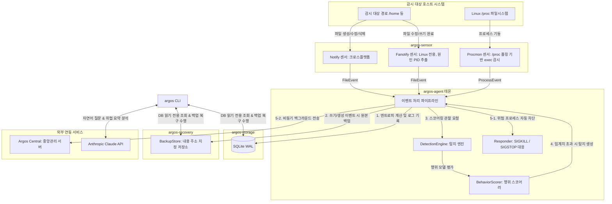

# Argos AI Security - 소스 코드 분석 및 아키텍처 상세 명세서

이 문서는 AI 기반 Linux 서버 보안 플랫폼인 **Argos AI Security**의 전체 소스 코드를 심도 있게 분석하고 아키텍처 및 내부 핵심 알고리즘의 작동 메커니즘을 상세히 기술한 시스템 명세서입니다.

---

## 1. 개요 및 설계 철학

Argos AI Security는 Linux 시스템에서 발생하는 다양한 파일 이벤트 및 프로세스 실행 이벤트를 실시간으로 모니터링하여 랜섬웨어, 비정상 행위, 권한 상승 등의 위협을 탐지하고 즉각 대응(프로세스 차단 및 네트워크 격리)하며 복구(롤백)하는 종합 EDR/안티 랜섬웨어 솔루션입니다. 

### 핵심 설계 철학
1. **메모리 안전성 및 고성능 (Rust 기반)**
   - 대량의 시스템 이벤트를 초당 수만 건 이상 안전하고 저지연으로 처리하기 위해 전체 데몬과 유틸리티를 Rust로 구현하였습니다.
2. **이벤트 파이프라인의 격리 및 확장성**
   - 센서 모듈, 탐지 엔진, 로컬 저장소, 백업/복구 솔루션, 대응 엔진 등을 크레이트(Crate) 단위로 모듈화하여 상호 의존성을 최소화하고 확장성을 극대화하였습니다.
3. **오탐 방지 및 단계적 차단**
   - 정상 시스템 작업(백업, 로그 로테이션 등)으로 인한 업무 중단 리스크를 최소화하기 위해 탐지 강도 및 점수 기반의 세밀한 정책 제어, 자동 차단의 기본 비활성화 옵션을 제공합니다.
4. **AI 기술과의 RAG 기반 융합**
   - Anthropic Claude API를 활용해 실제 탐지된 저수준 시스템 로그만을 근거로 명확한 원인을 요약 및 분석하는 AI Threat Summary 및 Copilot 기능을 내장하였습니다.

---

## 2. 아키텍처 및 데이터 흐름

Argos 에이전트는 독립된 컴포넌트들이 비동기 채널을 통해 유기적으로 연결된 파이프라인 구조를 가집니다.



### 데이터 파이프라인 흐름
1. **이벤트 수집 (Sensor)**: 파일 시스템 감시 백엔드(`notify`/`fanotify`) 및 프로세스 모니터가 이벤트를 발생시키고 Tokio MPSC 채널에 전송합니다.
2. **엔트로피 측정 및 로깅 (Agent & Storage)**: 파일 수정(`Modify`) 이벤트 발생 시 대상 파일의 전반부(64KB) 바이너리 엔트로피를 계산하고 SQLite 데이터베이스에 기록합니다.
3. **내용 주소 지정 백업 (Recovery)**: 파일이 수정되거나 생성되기 직전 원본 상태의 파일을 고유한 SHA-256 해시값 기반의 객체 저장소에 백업합니다.
4. **위협 탐지 (Detect)**: `DetectionEngine` 내의 `BehaviorScorer`가 실시간으로 프로세스(혹은 호스트)별 10초 슬라이딩 윈도우 내 파일 변경량, 고엔트로피 쓰기 비율, Rename/Delete churn 비율을 계산하여 점수를 산출합니다.
5. **대응 및 보고 (Response & Central)**: 점수가 위험 임계치를 초과할 시 `Responder`를 통해 위협 프로세스를 강제 종료(`SIGKILL`)하거나 일시 정지(`SIGSTOP`)하며, 중앙관리 서버(`Argos Central`)로 탐지 이벤트를 실시간 보고합니다.

---

## 3. 서비스 및 컴포넌트별 상세 명세

Argos 시스템을 구성하는 11개 크레이트 및 실행 프로그램 단위의 상세 설명입니다.

```
Argos AI Security Workspace
  ├── [실행 프로그램 (Daemon/CLI/Server)]
  │     ├── argos-agent   (백그라운드 에이전트 서비스)
  │     ├── argos-cli     (관리자 명령행 도구)
  │     └── argos-central (중앙 서버 및 웹 대시보드)
  └── [라이브러리 컴포넌트]
        ├── argos-common   (공통 설정 및 자료형)
        ├── argos-sensor   (커널/OS 이벤트 센서)
        ├── argos-detect   (위협 행위 스코어러 및 탐지 엔진)
        ├── argos-storage  (SQLite WAL 데이터 로깅 스토어)
        ├── argos-response (프로세스 차단 및 iptables 격리 엔진)
        ├── argos-recovery (내용 주소 백업 및 무결성 원자 복구)
        └── argos-policy   (Ed25519 서명 정책 무결성 유닛)
```

---

### 3.1. 에이전트 서비스: `argos-agent`
호스트 시스템에 상주하며 전체 탐지 및 대응 라이프사이클을 통제하는 systemd 데몬 프로세스입니다.

* **역할 및 책임**:
  - 설정 구성 로드 및 유효성 검증.
  - 감시 대상 경로 자동 감지 및 시동 시 원본 파일들을 1차 전수 백업(`baseline_backup`).
  - 파일 시스템 센서 및 프로세스 센서 기동.
  - Tokio 비동기 루프 기반 멀티플렉싱 이벤트 분배 처리.
  - 로컬 이벤트 데이터 로깅 및 CAS 백업 릴레이.
  - 탐지 시 차단 조치 실행 및 중앙 서버 백그라운드 전송 보고.
* **주요 소스 파일**:
  1. **[main.rs](file:///d:/project/ArgosAISecurity/crates/argos-agent/src/main.rs)**:
     - `main`: 비동기 진입점. CLI 아규먼트로 설정 파일 경로(기본: `argos.toml`)를 받아 `AgentConfig::load`를 실행합니다.
     - 서명 정책 설정(`policy.path`)이 있는 경우, [argos-policy](file:///d:/project/ArgosAISecurity/crates/argos-policy/src) 라이브러리를 사용해 공개키 대조 검증을 수행하고, 정상 통과 시 탐지 및 대응 구성 매개변수를 교체합니다.
     - `tokio::select!` 매크로를 이용해 파일 감시 채널(`rx`), 프로세스 감시 채널(`proc_rx`), 그리고 Ctrl+C 종료 시그널 감지를 비동기 병렬 대기 및 라우팅합니다.
     - `process_event`: 수신한 개별 `FileEvent`에 대해 파일 수정 시 앞부분 64KB의 엔트로피를 계산하여 구조체에 바인딩하고, SQLite DB와 백업CAS에 기록한 뒤 `DetectionEngine::observe`를 실행합니다. 스코어가 차단 임계치(`block_score`)를 넘어서면 차단 작업을 유발합니다.
     - `baseline_backup`: 에이전트 기동 시 감시 경로 내의 기존 파일들을 스택 기반 디렉터리 순회(DFS) 방식으로 전수 조사해 CAS에 최초 버전을 저장합니다.
  2. **[reporter.rs](file:///d:/project/ArgosAISecurity/crates/argos-agent/src/reporter.rs)**:
     - 비동기 Tokio 컨텍스트와 무관하게 동작하는 OS Native 백그라운드 전송 스레드를 구동합니다.
     - `spawn` 함수가 호출되면 채널 쌍(`std::sync::mpsc::channel`)을 만들어 송신단(`Sender<Detection>`)을 에이전트 메인 제어 루프에 제공하고, 수신 스레드(`argos-reporter`)를 실행합니다.
     - 스레드 구동 즉시 HTTP REST API(`POST /api/v1/agents/register`)를 통해 중앙서버에 호스트 정보 등록을 요청하고, 채널을 통해 전달되는 탐지 이벤트를 `POST /api/v1/detections` 엔드포인트로 무제한 릴레이합니다.

---

### 3.2. 관리자 명령행 도구: `argos-cli`
로컬 호스트의 보안 상태 진단, 이벤트 감사, 수동 파일 원복, AI 기반의 위협 분석 조회를 총괄적으로 수행하는 관리자 전용 명령어 도구입니다.

* **역할 및 책임**:
  - 에이전트 상태 및 통계 모니터링 (`status`).
  - 로컬 SQLite DB에서 수집 이벤트 및 위협 정보 덤프 출력 (`events`, `threats`).
  - 특정 탐지 식별자에 관한 Claude API 요약 분석 요청 (`explain`).
  - 대화형 코파일럿을 이용한 자연어 시스템 감사 진행 (`ask`).
  - 특정 시점으로 파일 무결성 원자적 원복 수행 (`restore`).
  - 임의 디렉터리 내 암호화 의심 고엔트로피 파일 긴급 스캔 (`scan`).
  - iptables 기반 네트워크 격리 활성화/해제 (`isolate`).
  - Ed25519 관리 정책 서명키 생성 및 검증키 기반 정책 검증 테스트 (`policy`).
* **주요 소스 파일**:
  1. **[main.rs](file:///d:/project/ArgosAISecurity/crates/argos-cli/src/main.rs)**:
     - `clap` 서브커맨드 구조를 지닌 `Cli` 및 `Command` 열거형을 선언하여 CLI 명세를 선언적으로 구성했습니다.
     - `open_store`: 에이전트가 가동 중이더라도 동시 조회가 가능하도록 SQLite DB를 `open_readonly` 플래그를 이용해 독자적으로 열어서 통계를 조회합니다.
     - `cmd_explain`: 선택한 탐지 ID의 레코드를 확보한 뒤, 탐지 시각 기준 10초 윈도우 전후의 로컬 파일 시스템 이벤트 로그를 SQLite에서 추출하여 `DetectionContext`를 작성한 뒤, Anthropic Claude API로 사고 분석 보고서 생성을 요청합니다.
     - `cmd_restore`: 백업 CAS 디렉터리에서 타겟 파일의 백업 버전 이력을 SQLite `index.db`에서 찾아 나열하거나(`--list` 활성 시), 검증된 무결성 CAS 백업 파일을 강제 rename 하여 기존 파일을 덮어씁니다.
     - `cmd_ask`: 호스트 구성 정보 및 최근 탐지, 파일 쓰기 로그, 프로세스 실행 로그를 한곳에 취합한 RAG(검색 증강 생성)용 덤프 컨텍스트를 구성한 후 사용자 자연어 질의와 함께 Claude API에 질문을 포워딩합니다.
     - `cmd_isolate`: `argos-response` 크레이트 내 `isolate` 모듈을 연동해 iptables 차단 체인을 동적 빌드 및 릴레이합니다.

---

### 3.3. 중앙관리 서버 및 대시보드: `argos-central`
수많은 호스트에 흩어진 Argos 에이전트로부터 등록 신호 및 위험 위협 정보를 비동기 수집하여 모니터링 화면을 표출해 주는 원격 관리 서버입니다.

* **역할 및 책임**:
  - 에이전트 노드 등록 및 생존 주기 상태 관리 (`/api/v1/agents/register`).
  - 탐지 위협 정보 수집 및 다중 조회 API 제공 (`/api/v1/detections`).
  - 관리 인증을 위한 공유 Bearer 토큰 정책 구현.
  - 전용 HTML 웹 현황판 화면 배포.
* **주요 소스 파일**:
  1. **[main.rs](file:///d:/project/ArgosAISecurity/crates/argos-central/src/main.rs)**:
     - Axum 웹 서비스 진입점. CLI 환경 인자(`--listen`, `--db`, `--token`)를 파싱하여 TCP 포트를 대기합니다.
     - 중앙 관제용 로컬 SQLite DB(`central.db`)를 별도로 초기화하고 `agents` 및 `detections` 관계형 테이블을 선언합니다.
     - `authorize`: 모든 수집/조회 엔드포인트 기동 전 `Authorization` HTTP 헤더 상의 Bearer 공유 비밀 토큰 대조 과정을 적용합니다.
     - `register_agent`: 새로운 에이전트의 ID 및 호스트명 등록 신호를 수신해 SQLite에 기입하거나 업데이트합니다.
     - `ingest_detection`: 보고받은 감염 노드의 탐지 정보를 기록하고, 해당 에이전트의 최근 통신 수신 시간(`last_seen_ms`)을 실시간 갱신합니다.
     - `/` 엔드포인트 접근 시 HTML 파일([dashboard.html](file:///d:/project/ArgosAISecurity/crates/argos-central/src/dashboard.html))을 메모리 스트림으로 직접 내려보내 브라우저에 배포합니다.
  2. **[dashboard.html](file:///d:/project/ArgosAISecurity/crates/argos-central/src/dashboard.html)**:
     - 단일 정적 웹 문서로 구성되었습니다. 순수 CSS 스타일 디자인과 바닐라 JavaScript Fetch API를 활용해 초고속 렌더링이 가능하게 설계되었습니다.
     - 5초 간격의 클라이언트 폴링 로직을 지니며 최근 차단/탐지 노드 통계를 비동기 갱신해 출력합니다.

---

### 3.4. 공통 설정 및 자료형 라이브러리: `argos-common`
시스템 내에서 공유되는 핵심 구성 정보와 공통 이벤트 규격을 한곳에 보관하는 척추 컴포넌트입니다.

* **역할 및 책임**:
  - 공통 설정값 및 파일 경로 변환 함수 수록.
  - 에이전트 감시 정보 구조체 정의.
  - 파일 시스템 및 프로세스 공통 데이터 모델 제공.
* **주요 소스 파일**:
  1. **[config.rs](file:///d:/project/ArgosAISecurity/crates/argos-common/src/config.rs)**:
     - `AgentConfig`: 에이전트 데몬 설정 정보의 루트 매핑 대상입니다.
     - `DetectionConfig`: 윈도우 폭(`window_secs`), 대량 쓰기 조건 개수(`mass_change_threshold`), 최소 판단 변경 건수(`min_changed_files`), 암호화 의심 엔트로피 스펙트럼 기준(`entropy_threshold`) 등의 탐지 필터 파라미터를 담고 있습니다.
     - `ResponseConfig`: 자동 차단 실행 여부(`auto_block`) 및 행동 대응 점수 커트라인(`block_score`)을 포함합니다.
     - `BackupConfig`: CAS 디렉터리 경로 및 단일 파일 최대 용량(`max_file_bytes`), 보존 수량 제한 정보를 보관합니다.
  2. **[event.rs](file:///d:/project/ArgosAISecurity/crates/argos-common/src/event.rs)**:
     - `FileAction`: 개별 파일 시스템 이벤트의 델타 액션 형식을 표현하는 열거형입니다.
     - `FileEvent`: 커널 드라이버나 파일 시스템 모니터가 내보내는 가장 기본적인 로우 데이터 모델입니다.
     - `ProcessEvent`: 프로세스 계층의 라이프사이클을 매핑하기 위해 실행 사용자 UID, 부모 PID(PPID), 실행 명령어 전체 인자를 수록합니다.
     - `Detection`: 행위 점수가 합산된 후 선언되는 위협 탐지 정보의 결과 구조체입니다.

---

### 3.5. 파일 및 프로세스 감시 센서: `argos-sensor`
호스트 OS 커널 레벨 및 파일 시스템 상에서 일어나는 모든 기초 이벤트를 저수준 후킹 및 인터셉트하여 파이프라인으로 전송해 주는 물리 센서 모듈입니다.

* **역할 및 책임**:
  - 디렉터리 재귀 감시를 통한 실시간 변경 탐지.
  - 리눅스 fanotify 바인딩 및 파일 수정 발생의 원인 PID 디코딩.
  - `/proc` 스캔 기반 프로세스 생명 주기 추적.
* **주요 소스 파일**:
  1. **[lib.rs](file:///d:/project/ArgosAISecurity/crates/argos-sensor/src/lib.rs)**:
     - `spawn_sensor` 유틸리티 함수를 제공하여 상위 에이전트가 백엔드 내부 상세 동작 방식을 알지 못해도 크로스플랫폼 `notify` 및 리눅스 전용 `fanotify` 센서를 일관된 인터페이스로 구동할 수 있도록 은닉화했습니다.
     - `RecommendedWatcher` 인터페이스를 래핑하여 리눅스 계열이 아닌 환경에서도 파일 생성, 수정, 삭제, 이름 변경 이벤트를 콜백 함수로 가로챈 후 비동기 MPSC 채널 송신을 처리합니다.
  2. **[fanotify.rs](file:///d:/project/ArgosAISecurity/crates/argos-sensor/src/fanotify.rs) (Linux 전용)**:
     - `libc::fanotify_init` 및 `libc::fanotify_mark` 시스콜을 호출하여 마운트 단위(`FAN_MARK_MOUNT`)로 변경을 모니터링합니다.
     - 수집 루프(`read_loop`) 내부에서, 수신된 이진 메타데이터 블록 내 `fd` 멤버를 추출하여 `/proc/self/fd/<fd>` 링크 대상을 역추적하는 `read_link` 기법을 통해 실제 감시 대상 경로에 포함되는 이벤트만 선별 여과(Prefix Filter)합니다.
     - 이벤트 구조체 내 `pid` 변수를 활용해 쓰기 행위를 감행한 실제 공격자 프로세스 PID를 확보합니다.
  3. **[procmon.rs](file:///d:/project/ArgosAISecurity/crates/argos-sensor/src/procmon.rs) (Linux 전용)**:
     - 주기적인 `/proc` 폴링 스레드를 동작시켜 기동 중인 모든 프로세스의 PID 세트를 해시 셋(`HashSet<u32>`)에 보관하고 대조합니다.
     - 신규 식별 프로세스가 드러날 경우 `/proc/<pid>/status` 파싱으로 PPID 및 UID 정보를 채우고, `/proc/<pid>/cmdline` 바이너리 내부의 Null 문자(`\0`)를 스페이스 문자로 치환 가공하여 실행 형태의 문자열을 복원합니다.

---

### 3.6. 위협 탐지 분석 엔진: `argos-detect`
로우 센서 이벤트 스트림을 관찰하여 랜섬웨어의 전형적인 공격 파일 훼손 동작을 실시간 스코어링하는 감시 두뇌부입니다.

* **역할 및 책임**:
  - 개별 프로세스 행동의 윈도우 수집 및 시간 경과 삭제 관리.
  - Shannon 엔트로피 고속 계산.
  - 위협 등급 판정 및 탐지 중복 발행 방지.
* **주요 소스 파일**:
  1. **[entropy.rs](file:///d:/project/ArgosAISecurity/crates/argos-detect/src/entropy.rs)**:
     - `file_entropy`: 파일을 안전하게 읽기 전용으로 열어 최상단 바이너리 스트림 버퍼를 샘플링하고 `shannon_entropy` 함수로 인계합니다.
     - `shannon_entropy`: 데이터의 바이트 배열을 카운팅(0~255 빈도수 배열)하여 점유 확률 분포 $P(x_i)$를 획득하고, 정보 이론에 입각한 총합 계산을 통해 엔트로피를 산출합니다.
  2. **[scorer.rs](file:///d:/project/ArgosAISecurity/crates/argos-detect/src/scorer.rs)**:
     - `BehaviorScorer`: 프로세스 PID별로 `VecDeque<WindowEntry>`를 메모리 맵 상에 분할하여 유지합니다.
     - `observe`: 새로운 이벤트가 들어오면 기존 버퍼의 꼬리에 붙이고 설정된 윈도우 시간 범위(`window_secs`초 전 시점)보다 밀려난 헤드 부분의 오래된 데이터 엔트리는 메모리에서 해제합니다.
     - 변경 파일 개수가 기본 임계 개수(`min_changed_files`)에 도달하지 않은 미미한 일상적 변경은 점수 검사 없이 즉시 종료해 오탐 가능성을 낮춥니다.
     - `score`: 수식 계산 알고리즘에 기초하여 Mass(변경 확산도), Enc(파일 난수도), Churn(확장자 치환도)을 합산하여 0에서 100 사이의 실수를 결정합니다.
     - **중복 억제 쿨다운**: 동일 PID에서 한번 탐지가 발행되면 윈도우 주기 동안 유사 점수의 탐지는 묵살하되, 가중치가 15점 이상 급증하는 중점 악화 상태(`ESCALATION_DELTA`) 감지 시에 한하여 쿨다운 필터를 바이패스하고 경고를 재발행합니다.

---

### 3.7. SQLite WAL 로컬 데이터베이스: `argos-storage`
에이전트가 기록하는 실시간 이벤트를 유실 없이 고속 영구 보관하고 CLI 도구가 비동기 방식으로 안전하게 감사 로그를 읽어갈 수 있도록 보장하는 저장 공간입니다.

* **역할 및 책임**:
  - 로컬 관계형 데이터베이스 테이블 및 최적 검색 인덱스 인프라 초기화.
  - 초당 고빈도로 수집되는 로우 파일 이벤트 및 프로세스 감시 정보 인서트 처리.
  - 위협 이력 보존 및 조회 인터페이스 제공.
  - 시간대 범위 기반 로그 필터링 쿼리 제공 (AI RAG 분석용).
* **주요 소스 파일**:
  1. **[lib.rs](file:///d:/project/ArgosAISecurity/crates/argos-storage/src/lib.rs)**:
     - `EventStore`: rusqlite 커넥션 구조체를 소유합니다.
     - `open`: DB 커넥션을 획득한 직후 데이터베이스 파일의 쓰기 성능 및 읽기 성능을 보장하기 위해 `PRAGMA journal_mode=WAL` 및 `PRAGMA synchronous=NORMAL` 튜닝을 동기적으로 강제 적용합니다.
     - `file_events` (시각, PID, 경로, 행위타입, 파일크기, 엔트로피), `detections` (시각, 룰명칭, 점수, 심각도, 요약문, PID, 경로 목록 JSON), `process_events` (시각, PID, 부모PID, 유저ID, 실행명칭, 명령어 인자) 테이블 스키마 선언부를 자동 수행합니다.
     - `recent_events` / `recent_detections` / `recent_processes`: SQL 질의문 처리를 통해 CLI 출력 및 관제 서버 전달을 위한 고속 오프셋 페이징 버퍼 조회 인터페이스를 구현합니다.
     - `events_between` / `processes_between`: AI Explainer 모듈이 시간대를 기반으로 로그를 슬라이스해 RAG Reranking 컨텍스트를 구성할 수 있도록 지원하는 범위 조회 함수입니다.

---

### 3.8. 프로세스 제어 및 네트워크 격리: `argos-response`
이상 징후 포착 순간 동작하여 위해 프로세스의 생명 주기를 제어하고 전체 네트워크 통신을 단절시키는 방어용 차단 유닛입니다.

* **역할 및 책임**:
  - 특정 위험 프로세스 기동 제거 시그널 송신.
  - 비정상 아웃바운드 C2 연결 차단 및 롤백 해제 처리.
* **주요 소스 파일**:
  1. **[lib.rs](file:///d:/project/ArgosAISecurity/crates/argos-response/src/lib.rs)**:
     - `ResponseAction` 열거형을 제공하여 시그널 동작(`KillProcess`, `SuspendProcess`)을 구체화합니다.
     - `LinuxResponder`: Linux 시그널 시스템 콜 `libc::kill`을 안전하게 호출하여 대상 PID에 `SIGKILL`과 `SIGSTOP` 시그널을 주입합니다.
     - `make_responder`: 정책이 `auto_block=false`이거나 Windows 등 다른 플랫폼 환경인 경우 실 작동 대신 경고 로그만 남겨 안전 지대를 구축해 주는 `DryRunResponder`를 자동 선택하도록 팩토리화했습니다.
  2. **[isolate.rs](file:///d:/project/ArgosAISecurity/crates/argos-response/src/isolate.rs)**:
     - `isolation_commands`: 네트워크 아웃바운드를 제한하는 iptables 일체형 커맨드 셋을 정적 구성합니다.
     - 커스텀 차단 체인 `ARGOS_ISOLATE`를 신규 선언하고 루프백(`lo`), 기존 접속 유지를 위한 세션 연결(`ESTABLISHED,RELATED`)을 인가합니다.
     - 에이전트 설정상의 관리 서버 주소를 분석하고 전송 유지를 위한 `ACCEPT` 규칙을 최우선 적용한 뒤, 마지막 규칙으로 `DROP` 규칙을 위치시켜 외부와의 연결을 완전 차절시킵니다.
     - `release_commands`: 차단 해제 시 `OUTPUT` 체인에서 ARGOS_ISOLATE 점프 규칙을 탈거하고 체인을 비우며 소거하는 멱등성 명령을 구성합니다.

---

### 3.9. CAS 백업 및 해시 검증 복구: `argos-recovery`
탐지 이전 상태로 손상 파일의 무손실 원상 복구를 보장하며 불필요한 노후 버전 데이터 저장 공간을 관리하는 롤백 엔진입니다.

* **역할 및 책임**:
  - 내용 주소 지정(Content-Addressed Storage) 중복 제거 백업 처리.
  - 백업 버전 관계형 메타데이터 테이블 정보 보존.
  - 타겟 시점 및 최신 상태의 해시 검증 원자 원복.
  - 백업 보존 한계 버스팅 방지를 위한 정리(`prune`) 프로세스 구동.
* **주요 소스 파일**:
  1. **[lib.rs](file:///d:/project/ArgosAISecurity/crates/argos-recovery/src/lib.rs)**:
     - `BackupStore`: CAS의 루트 경로와 백업 버전 인덱스를 기록할 독자적인 SQLite 커넥션(`index.db`)을 소유합니다.
     - `backup`: 파일 수정 전 상태의 데이터를 읽어 SHA-256 해시를 도출하고, `objects/<해시앞2자리>/<해시>` 위치에 객체가 부재한 경우에 한하여 임시 파일 쓰기 및 rename 기법으로 중복을 제거하여 저장합니다. 직전 버전과 동일한 해시인 경우 백업 저장을 취소하고 None을 반환하여 IO 리소스를 세이브합니다.
     - `restore`: 타겟 시각 이전 기준 최적 백업을 검색하고, 백업된 객체의 실제 파일 데이터 바이트 스트림을 로드한 뒤 SHA-256 해시를 즉석에서 재연산해 원본 무결성 여부를 크로스 체크합니다. 무결성이 입증된 파일은 `<원본경로>.argos-restore-tmp` 파일로 쓴 뒤 rename 시스콜로 본 파일을 덮어쓰는 원자적 복원을 마칩니다.
     - `prune`: 윈도우 파일 시스템 감시 중인 디렉터리에 노후 버전이 과적되어 생기는 디스크 풀(Full) 에러를 막기 위해 경로당 설정 개수(`keep`)를 초과하는 레코드를 걷어내고, versions DB에 남겨진 참조 키값이 단 하나도 존재하지 않는 격리된 CAS 파일을 탐색해 실제로 지워줍니다.

---

### 3.10. Ed25519 서명 정책 제어 장치: `argos-policy`
인가되지 않은 침입자가 에이전트 내부 설정을 개조해 백업 경로를 변조하거나 차단 임계치를 인위적으로 상향시켜 탐지를 회피하는 위협 행동을 원천 차단하는 무결성 검증 유닛입니다.

* **역할 및 책임**:
  - Ed25519 디지털 키쌍 생산 지원.
  - 임의 바이트 스트림에 관한 전자 서명 생성 및 유효성 대조.
  - 암호 인증을 필한 클린 정책 구조체 역직렬화 반환.
* **주요 소스 파일**:
  1. **[lib.rs](file:///d:/project/ArgosAISecurity/crates/argos-policy/src/lib.rs)**:
     - `Policy`: 배포 및 서명 대상인 구조체로 `version` 및 `DetectionConfig`, `ResponseConfig`를 포함하고 있어 에이전트의 행위 매개변수를 교체합니다.
     - `gen_keypair`: `rand_core::OsRng` 엔트로피 소스를 활용해 안전한 32바이트 Ed25519 비밀키와 대응하는 검증용 공개키를 무작위 생성합니다.
     - `sign_file`: 지정된 비밀키 hex 값을 복원해 입력 정책 파일의 원시 바이트 전체를 서명한 후, 그 결과 서명 해시를 동명의 `.sig` 파일(예: `policy.toml.sig`)에 영구 저장합니다.
     - `load_verified`: 대상 파일과 `.sig` 서명 내용을 로드해 대조합니다. 검증 실패 시 즉시 `InvalidSignature` 암호학적 신뢰성 거부 에러를 던져 변조 설정의 침투 시도를 봉쇄합니다.

---

### 3.11. AI 분석 브레인 모듈: `argos-brain`
시스템의 저수준 로그 데이터와 자연어 대화 모델 간의 징검다리 역할을 수행하며, 신뢰도 높은 인공지능 분석 환경을 지원하는 서포트 라이브러리 컴포넌트입니다.

* **역할 및 책임**:
  - Anthropic Messages API 전송 바인딩.
  - 프롬프트 템플릿 제어 및 RAG 정보 융합.
  - AI Hallucination(환각 현상) 제어를 위한 프롬프트 통제.
* **주요 소스 파일**:
  1. **[lib.rs](file:///d:/project/ArgosAISecurity/crates/argos-brain/src/lib.rs)**:
     - `ThreatExplainer`: 환경 변수 `ANTHROPIC_API_KEY`를 로드하여 Claude API 블로킹 클라이언트를 기동합니다.
     - `explain`: 수신받은 `DetectionContext`에 수록된 요약문 및 관련 파일들의 경로 리스트, 탐지 직전 시점부터 기록된 파일 I/O 이벤트를 프롬프트 문자열로 동적 합성합니다.
     - RAG에 주입되는 정보 외부의 무리한 상상 및 보안 분석 추론을 엄단하는 통제 프롬프트(`SYSTEM_PROMPT`)를 인계하여 정확히 명시된 로그만을 근거로 분석 레포트를 도출합니다.
     - `ask`: CLI copilot의 대화 입력을 받아 `CopilotContext` 상의 호스트 정보 및 누적된 위협, 파일, 프로세스 기록 데이터 베이스를 Claude에 함께 공급하여 사실에 입각한 대화 답변을 실시간 유도합니다.

---

## 4. 핵심 알고리즘 메커니즘 명세

### 4.1. 랜섬웨어 행위 기반 탐지 스코어링 수식
행위 스코어러(`BehaviorScorer`)는 10초 윈도우 버퍼 내의 이벤트들을 분류하여 3가지 지표의 합산(0 ~ 100점)으로 계산합니다.

$$Score = MassChangeScore(40) + EntropyScore(35) + ChurnScore(25)$$

1. **Mass Change Score (최대 40점)**:
   - 고유 경로 변경 개수($N_{path}$) 대비 탐지 설정의 대량 변경 기준값($MassThreshold$, 기본값 30개)의 비율로 가중 계산합니다.
   $$MassChangeScore = \min\left(1.0, \frac{N_{path}}{MassThreshold}\right) \times 40$$
2. **Entropy Score (최대 35점)**:
   - 전체 변경된 파일 중 Shannon 엔트로피 실측값이 임계 점수($EntropyThreshold$, 기본값 7.2)를 상회하는 고엔트로피 파일 개수($N_{high\_entropy}$)의 비율로 계산합니다.
   $$EntropyScore = \min\left(1.0, \frac{N_{high\_entropy}}{N_{path}}\right) \times 35$$
3. **Churn Score (최대 25점)**:
   - 전체 파일 시스템 행동 이벤트 건수($N_{event}$) 대비 이름 변경($Rename$) 및 삭제($Delete$) 행위의 합산 발생 빈도로 판독합니다.
   $$ChurnScore = \min\left(1.0, \frac{N_{rename} + N_{delete}}{N_{event}}\right) \times 25$$

#### 심각도 분류
- 점수 $\ge 85$: `Critical`
- 점수 $\ge 65$: `High`
- 점수 $\ge 40$: `Medium`
- 점수 $< 40$: `Low`

---

### 4.2. 내용 주소 지정 백업(CAS) 및 원자적 복구 동작 원리
랜섬웨어 감염이나 파일 변조 사고 발생 시 무결성이 검증된 상태로 안전하게 파일을 원상 복구하기 위해 CAS 및 원자적 대치 기법을 이용합니다.

```
[백업 절차]
원본 파일 변경 이벤트 감지
  │
  ▼
원본 파일의 SHA-256 해시 계산
  │
  ├─► 직전 백업 버전 해시와 동일? ──► [종료 (중복 백업 생략)]
  │
  ▼
objects/ 디렉터리 내에 해당 해시 파일 존재 여부 확인
  │
  ├─► 이미 존재? ──────────────────► [SQLite 메타 인덱스 테이블에 버전 기록만 추가]
  │
  ▼
임시 파일(.tmp) 생성 후 데이터 쓰기
  │
  ▼
원하는 해시 명칭 기반 경로(objects/xx/xxxxxxxx...)로 원자적 이름 변경(rename) 실행
  │
  ▼
SQLite 인덱스 DB(versions)에 (경로, 해시, 파일 크기, 타임스탬프, PID) 레코드 추가
```

```
[복구 절차]
사용자가 복구 요청 (argos restore <경로> --before-ms <시점>)
  │
  ▼
인덱스 DB에서 해당 경로의 시점 기준 최적의 해시(hash) 및 메타데이터 조회
  │
  ▼
objects/ 경로에서 해시 파일 탐색
  │
  ▼
해당 파일 전체 데이터를 읽고 SHA-256 해시를 직접 재계산하여 무결성 검증
  │
  ├─► 해시 불일치? ─────────────► [무결성 에러 발생 및 복구 즉시 차단]
  │
  ▼
복구 타겟 경로와 동일 위치에 임시 원복 파일(<경로>.argos-restore-tmp) 작성
  │
  ▼
이름 변경(rename) 시스템 콜 호출하여 원복 완료 (대상 쓰기 차단 경합 해소 및 원자성 확보)
```

---

### 4.3. Ed25519 서명 정책 적용 제어 로직
정책 변조 및 위협 완화 공격을 원천 무력화하기 위한 서명 정책 흐름도입니다.

```
[관리 머신]                                     [서버 에이전트 노드]
정책 작성 (policy.toml)                        argos.toml 구동 설정 로드
  │                                              │
  ▼                                              ▼
서명키로 서명 서명생성                            policy.toml.sig 정책 서명 파일 탐색
  │                                              │
  ▼                                              ▼
policy.toml.sig 생성                             argos.toml 내 지정된 공개키(pubkey) 추출
  │                                              │
  ▼                                              ▼
정책 배포 ──────────────────────────────────────► Ed25519 디지털 서명 대조 검증 수행
                                                 │
                                                 ├─► 서명 검증 실패? ──► [경고 로그 출력 및 이전 기본 탐지 정책 강제 유지]
                                                 │
                                                 ▼
                                               서명 검증 성공 시 설정 세팅 동적 교체
```

---

## 5. 알려진 한계 및 장래 개선 로드맵

현재 Argos AI Security MVP 버전은 핵심 위협 탐지 및 복구 프로세스가 안정적으로 구축되어 작동하고 있으나, 다음과 같은 한계를 인지하고 있으며 향후 고도화 단계에서 개선될 예정입니다.

1. **inotify (notify Crate) 기반 수집 한계**
   - notify 백엔드 구동 시 파일 이벤트를 발생시킨 원인 프로세스의 PID를 획득할 수 없어 호스트 단위 탐지만 제공 가능하며 정밀한 단일 프로세스 타겟 차단이 곤란합니다.
   - *해결 방안*: Linux 전용 `fanotify` 센서를 기본 적용하거나, eBPF 커널 프로브 센서를 통해 저수준 계층에서 직접 고해상도로 PID를 매핑합니다.
2. **단명(Short-lived) 프로세스 감시 누락 리스크**
   - 현재 구현된 프로세스 감시 모듈은 `/proc` 디렉터리의 1초 단위 폴링 방식을 사용하고 있어, 기동 후 수십 밀리초 이내에 자식 파일을 변조하고 스스로 자멸하는 고도로 설계된 단명 프로세스는 포착하지 못할 리스크가 존재합니다.
   - *해결 방안*: Phase 3에서 커널의 `sched_process_exec` 및 `sched_process_exit` Tracepoint 이벤트를 링 버퍼 방식으로 다이렉트 스트리밍하는 eBPF 센서 유닛을 신설합니다.
3. **대규모 데이터 처리량 한계**
   - SQLite 로컬 저장소는 파일 I/O 동시성에 일정 한계가 존재하므로, 초당 20,000건 이상의 엔터프라이즈급 원시 이벤트가 폭주하는 시스템 환경에서는 데이터 경합이 심화될 우려가 있습니다.
   - *해결 방안*: 대용량 분산 컬럼 기반 DB인 ClickHouse를 중앙 서버 연동 데이터베이스 백엔드로 병합하고 에이전트 내부에 배치성 메모리 버퍼 및 필터링 윈도우를 도입합니다.
