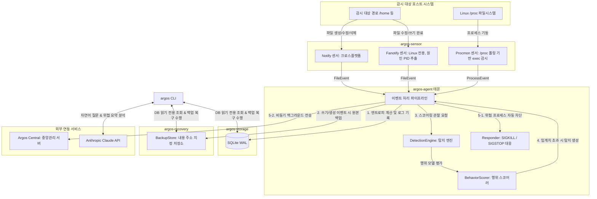

# Argos AI Security - 소스 코드 분석 및 아키텍처 상세 명세서

이 문서는 AI 기반 Linux 서버 보안 플랫폼인 **Argos AI Security**의 전체 소스 코드를 심도 있게 분석하고 아키텍처 및 내부 핵심 알고리즘의 작동 메커니즘을 상세히 기술한 시스템 명세서입니다.

---

## 1. 개요 및 설계 철학

Argos AI Security는 Linux 시스템에서 발생하는 다양한 파일 이벤트 및 프로세스 실행 이벤트를 실시간으로 모니터링하여 랜섬웨어, 비정상 행위, 권한 상승 등의 위협을 탐지하고 즉각 대응(프로세스 차단 및 네트워크 격리)하며 복구(롤백)하는 종합 EDR/안티 랜섬웨어 솔루션입니다. 

### 핵심 설계 철학
1. **메모리 안전성 및 고성능 (Rust 기반)**
   - 대량의 시스템 이벤트를 초당 수만 건 이상 안전하고 저지연으로 처리하기 위해 전체 데몬과 유틸리티를 Rust로 구현하였습니다.
2. **이벤트 파이프라인의 격리 및 확장성**
   - 센서 모듈, 탐지 엔진, 로컬 저장소, 백업/복구 솔루션, 대응 엔진 등을 크레이트(Crate) 단위로 모듈화하여 상호 의존성을 최소화하고 확장성을 극대화하였습니다.
3. **오탐 방지 및 단계적 차단**
   - 정상 시스템 작업(백업, 로그 로테이션 등)으로 인한 업무 중단 리스크를 최소화하기 위해 탐지 강도 및 점수 기반의 세밀한 정책 제어, 자동 차단의 기본 비활성화 옵션을 제공합니다.
4. **AI 기술과의 RAG 기반 융합**
   - Anthropic Claude API를 활용해 실제 탐지된 저수준 시스템 로그만을 근거로 명확한 원인을 요약 및 분석하는 AI Threat Summary 및 Copilot 기능을 내장하였습니다.

---

## 2. 아키텍처 및 데이터 흐름

Argos 에이전트는 독립된 컴포넌트들이 비동기 채널을 통해 유기적으로 연결된 파이프라인 구조를 가집니다.



### 데이터 파이프라인 흐름
1. **이벤트 수집 (Sensor)**: 파일 시스템 감시 백엔드(`notify`/`fanotify`) 및 프로세스 모니터가 이벤트를 발생시키고 Tokio MPSC 채널에 전송합니다.
2. **엔트로피 측정 및 로깅 (Agent & Storage)**: 파일 수정(`Modify`) 이벤트 발생 시 대상 파일의 전반부(64KB) 바이너리 엔트로피를 계산하고 SQLite 데이터베이스에 기록합니다.
3. **내용 주소 지정 백업 (Recovery)**: 파일이 수정되거나 생성되기 직전 원본 상태의 파일을 고유한 SHA-256 해시값 기반의 객체 저장소에 백업합니다.
4. **위협 탐지 (Detect)**: `DetectionEngine` 내의 `BehaviorScorer`가 실시간으로 프로세스(혹은 호스트)별 10초 슬라이딩 윈도우 내 파일 변경량, 고엔트로피 쓰기 비율, Rename/Delete churn 비율을 계산하여 점수를 산출합니다.
5. **대응 및 보고 (Response & Central)**: 점수가 위험 임계치를 초과할 시 `Responder`를 통해 위협 프로세스를 강제 종료(`SIGKILL`)하거나 일시 정지(`SIGSTOP`)하며, 중앙관리 서버(`Argos Central`)로 탐지 이벤트를 실시간 보고합니다.

---

## 3. 크레이트별 세부 소스 코드 분석

### 3.1. [argos-common](file:///d:/project/ArgosAISecurity/crates/argos-common/src)
에이전트 전체 설정 정보와 파이프라인에서 흐르는 공통 데이터 구조를 정의합니다. 다른 모든 크레이트가 의존하는 최하위 라이브러리입니다.

- **[config.rs](file:///d:/project/ArgosAISecurity/crates/argos-common/src/config.rs)**:
  - `AgentConfig`: 에이전트의 전체 설정을 담는 구조체입니다. `watch_paths`, `db_path`, `sensor` 종류, `detection` 가중치, `response` 임계치 및 백업 디렉터리 경로 정보를 포괄합니다.
  - `SensorKind`: `Notify`와 `Fanotify` 센서 타입을 정의합니다.
  - `PolicyFileConfig`: 중앙 관리 서버나 관리자가 Ed25519 서명 키를 통해 배포한 정책 파일의 경로와 검증을 위한 공개키(`pubkey`)를 관리합니다.
- **[event.rs](file:///d:/project/ArgosAISecurity/crates/argos-common/src/event.rs)**:
  - `FileAction`: `Create`, `Modify`, `Delete`, `Rename`, `Chmod`, `Chown` 등의 파일 작동 단위를 열거형으로 정의합니다.
  - `FileEvent`: 파일 이벤트를 나타내는 데이터 구조체로, 타임스탬프, 원인 PID(식별 불가 시 0), 경로, 액션 타입, 파일 크기 및 Shannon 엔트로피 실측값을 멤버로 지닙니다.
  - `ProcessEvent`: 프로세스 기동 정보(PID, PPID, UID, Comm, Cmdline)를 수집 및 저장하기 위한 구조체입니다.
  - `Detection`: 탐지 엔진이 위협을 선언했을 때 구성되는 구조체로 위협 점수(`score`), 위협 심각도(`Severity`), 대표 영향 경로 목록을 포함합니다.

---

### 3.2. [argos-sensor](file:///d:/project/ArgosAISecurity/crates/argos-sensor/src)
운영체제 커널 수준 혹은 파일 시스템 계층에서 실시간 이벤트를 포착하여 송신 채널로 릴레이하는 컴포넌트입니다.

- **[lib.rs](file:///d:/project/ArgosAISecurity/crates/argos-sensor/src/lib.rs)**:
  - 크로스 플랫폼 호환을 지원하는 `notify` 라이브러리 기반 센서(`spawn_notify_sensor`)를 기동합니다.
  - `notify` 센서는 Windows/macOS/Linux에서 안전하게 동작하지만, 파일 시스템 수정 이벤트를 유발한 프로세스의 PID를 가져올 수 없는 한계가 있어 PID를 `0`으로 일괄 보고합니다.
- **[fanotify.rs](file:///d:/project/ArgosAISecurity/crates/argos-sensor/src/fanotify.rs) (Linux 전용)**:
  - Linux 커널의 `fanotify` API를 활용하여 감시 경로가 속한 Mount 단위로 파일 수정을 모니터링합니다.
  - 이벤트 구조체에서 **원인 프로세스의 PID**를 직접 추출하므로 랜섬웨어를 전파하는 타겟 프로세스를 정확하게 차단할 수 있는 필수 전제 조건을 제공합니다.
  - 피드백 루프(자체 백업 데이터 쓰기 작업이 다시 탐지 대상이 되는 무한 루프) 방지를 위해 에이전트 자신의 PID로부터 발생한 이벤트는 무시합니다.
- **[procmon.rs](file:///d:/project/ArgosAISecurity/crates/argos-sensor/src/procmon.rs) (Linux 전용)**:
  - `/proc` 파일 시스템의 숫자 디렉터리를 주기적으로 스캔하여 프로세스 실행 정보를 수집하는 스레드(`spawn_proc_monitor`)를 구동합니다.
  - 이전 스캔과 비교하여 새로 생성된 PID의 `/proc/<pid>/comm`, `/proc/<pid>/cmdline`, `/proc/<pid>/status`를 읽어 실행 정보를 추적합니다.

---

### 3.3. [argos-detect](file:///d:/project/ArgosAISecurity/crates/argos-detect/src)
수집된 파일 이벤트를 분석하여 위협 여부를 스코어링 방식으로 판정하는 핵심 논리 엔진입니다.

- **[entropy.rs](file:///d:/project/ArgosAISecurity/crates/argos-detect/src/entropy.rs)**:
  - Shannon 엔트로피(바이트별 발생 확률 분포의 정보 엔트로피) 계산 알고리즘 `shannon_entropy`를 구현합니다.
  - 일반적인 텍스트나 소스 코드 파일은 엔트로피가 낮게 형성(3.0 ~ 5.0)되는 반면, 랜섬웨어에 의해 대칭키 암호화가 완료된 바이너리는 고르게 난수화되어 극한값에 가까운 고엔트로피(7.2 ~ 8.0)를 가집니다.
  - 성능 저하를 방지하기 위해 파일 전체가 아닌 전반부 최대 64KB 샘플(`entropy_sample_bytes`)만 읽어 엔트로피를 연산합니다.
- **[scorer.rs](file:///d:/project/ArgosAISecurity/crates/argos-detect/src/scorer.rs)**:
  - PID별로 독립된 이벤트 `VecDeque` 슬라이딩 윈도우를 운용합니다.
  - 대량 변경 건수, 고엔트로피 파일 생성 비율, 파일명 Rename/Delete churn 비율을 실시간 취합해 종합 위협 점수를 환산합니다. (자세한 공식은 4장 참고)
  - 동일 프로세스에 대해 윈도우 주기 동안 탐지 알람이 난발되지 않도록 Cooldown 메커니즘을 적용하되, 공격 양상이 악화되어 위험 점수가 15점 이상 상승할 경우 즉각 재통보하는 Escalation 예외 로직을 구비하였습니다.

---

### 3.4. [argos-storage](file:///d:/project/ArgosAISecurity/crates/argos-storage/src)
SQLite 데이터베이스를 기반으로 에이전트 내부의 로컬 이벤트 로그 및 탐지 이력을 보관하며, 다중 프로세스 간의 파일 잠금 경합을 해소합니다.

- **[lib.rs](file:///d:/project/ArgosAISecurity/crates/argos-storage/src/lib.rs)**:
  - SQLite의 **WAL(Write-Ahead Logging) 저널 모드** 및 **NORMAL 동기화 모드**를 켜서 동시성이 높은 환경에서도 쓰기 지연을 낮추고 에이전트 데몬과 CLI 간의 비차단 읽기를 보장합니다.
  - `file_events`, `detections`, `process_events`의 3가지 핵심 테이블 구조를 선언하고 최적 조회를 위한 타임스탬프 인덱스를 생성합니다.
  - CLI가 에이전트 동작을 방해하지 않고 독립적으로 조작할 수 있도록 파일 권한에 부합하는 `open_readonly` 빌더 함수를 제공합니다.

---

### 3.5. [argos-response](file:///d:/project/ArgosAISecurity/crates/argos-response/src)
탐지된 위협 시나리오에 즉각적으로 개입하여 위해 요소를 차단하고 시스템을 격리하는 대응 모듈입니다.

- **[lib.rs](file:///d:/project/ArgosAISecurity/crates/argos-response/src/lib.rs)**:
  - 위험 프로세스 차단을 위한 `Responder` 트레잇과 이를 구현한 `LinuxResponder`, `DryRunResponder`를 갖춥니다.
  - `LinuxResponder`는 `libc::kill` 인터페이스를 래핑하여 특정 PID에 `SIGKILL`(즉시 강제 종료) 및 `SIGSTOP`(분석용 일시 중지) 신호를 보냅니다.
  - **안전 제어 장치**: PID가 `0`인 차단 명령이 들어오는 경우 시스템의 주요 코어 프로세스가 연쇄 중단되는 참사를 미연에 방지하기 위해 무조건 `UnknownPid` 에러를 반환하며 작업을 차단합니다.
- **[isolate.rs](file:///d:/project/ArgosAISecurity/crates/argos-response/src/isolate.rs)**:
  - Linux `iptables` 명령 도구를 연동하여 감염 호스트의 아웃바운드 트래픽을 차단하는 네트워크 격리 체인을 구현합니다.
  - 전송 유지를 위해 루프백 인터페이스(`lo`), 기존 활성화된 세션(`ESTABLISHED, RELATED`), 그리고 정책상 명시된 중앙서버 주소는 예외로 허용하고 나머지 모든 송신 패킷은 `DROP`으로 폐기시킵니다.

---

### 3.6. [argos-recovery](file:///d:/project/ArgosAISecurity/crates/argos-recovery/src)
랜섬웨어 감염 시 피해 이전 상태로 완벽한 파일 원복을 목표로 설계된 로컬 섀도 백업 및 무결성 검증 복구 모듈입니다.

- **[lib.rs](file:///d:/project/ArgosAISecurity/crates/argos-recovery/src/lib.rs)**:
  - **내용 주소 지정 저장소(Content-Addressed Storage, CAS)**: 데이터의 중복 적재를 원천 차단하기 위해 원본 파일 내용의 SHA-256 해시값을 기반으로 저장소 객체 경로(`<backup_dir>/objects/xx/xxxxxxxx...`)를 매핑합니다.
  - 원본 파일의 디바이스 경로 및 버전 관리 메타데이터 정보는 독립된 SQLite 인덱스 데이터베이스(`index.db`)에서 상호 관리합니다.
  - 백업이 동작할 때 이미 동일한 해시 내용이 CAS 상에 있다면 쓰기 작업을 생략하여 저장 용량 효율성을 극대화합니다.
  - **원자적 복원(Atomic Restore)**: 복구 작업(`restore`) 시 대상 임시 파일을 별도로 작성한 다음 파일 이름 변경(`rename`) 시스템 콜을 사용해 원자적으로 대치하므로, 복구 과정에서 발생할 수 있는 쓰기 끊김 현상과 데이터 변형을 완벽히 방지합니다.
  - 복원 실행 직전 CAS 내부 백업본 객체의 SHA-256 해시를 실제로 다시 검사하여 데이터 무결성을 검증합니다.
  - `prune` 함수를 두어 개별 경로당 사전에 정의된 개수(`keep_versions`)를 초과하는 오래된 이력을 자동으로 일괄 소거하고 참조되지 않는 찌꺼기 해시 객체를 정리합니다.

---

### 3.7. [argos-policy](file:///d:/project/ArgosAISecurity/crates/argos-policy/src)
인가되지 않은 제3자에 의한 탐지 설정 변조 및 오동작 공격을 철저하게 방어하는 암호학적 신뢰성 제어 유닛입니다.

- **[lib.rs](file:///d:/project/ArgosAISecurity/crates/argos-policy/src/lib.rs)**:
  - 공개키 서명 알고리즘인 **Ed25519**(`ed25519_dalek` 패키지)를 활용하여 정형 정책 구성 데이터(`policy.toml`)의 무결성을 검증합니다.
  - 서명 프로세스는 설정 구조체 전체를 파일 바이너리 바이트열 단위 그대로 보존한 채 작동하여 미세한 서식 차이로 인한 정규화 서명 오류를 사전에 원천 차단합니다.
  - 검증 단계가 성공적으로 인증 완료된 클린 정책 객체에만 유효한 덮어쓰기 로딩(`load_verified`) 권한을 부여하며, 검증 누락이나 1비트의 서명 변형이라도 식별되면 에이전트는 해당 변조 설정을 완전히 거부하고 내장된 시동 기본 설정을 강제로 고수합니다.

---

### 3.8. [argos-brain](file:///d:/project/ArgosAISecurity/crates/argos-brain/src)
위협 판단의 결과를 보안 비전문가도 직관적으로 즉각 이해할 수 있게 도와주는 거대 언어 모델 기반 보조 엔진입니다.

- **[lib.rs](file:///d:/project/ArgosAISecurity/crates/argos-brain/src/lib.rs)**:
  - Anthropic Claude API의 `Messages` 사양에 맞춰 동적 HTTP JSON 전송 요청을 처리하는 블로킹 래퍼를 수록합니다. (공식 크레이트 부재에 대응)
  - **AI Hallucination 방지 제약**: 모델에 제공되는 시스템 프롬프트(`SYSTEM_PROMPT`, `COPILOT_SYSTEM`)를 통제하여, 오직 SQLite로부터 조회해서 덤프한 실시간 시스템 로그 텍스트 조각과 탐지 메타데이터 정보만을 근거로 추론을 진행하도록 엄격히 한계를 설정합니다.
  - `explain`은 대상 탐지 타임스탬프 기준 전후 시점의 관련 시스템 파일/프로세스 실행 이벤트 문맥을 결합하여 요약, 근거 분석, 오탐 판독의 템플릿화된 한국어 보고서를 생성합니다.
  - `ask` 인터페이스는 CLI 코파일럿 기능을 구동하며 현재 호스트의 전체 작동 상태 정보 요약과 최근 누적 80건의 이벤트 및 프로세스 로깅 레코드를 통합한 컨텍스트 환경을 Claude에 제공합니다.

---

### 3.9. [argos-central](file:///d:/project/ArgosAISecurity/crates/argos-central/src)
중앙 관제 및 탐지 이벤트 통제를 전담하는 초경량 웹 관리 서버 유닛입니다.

- **[main.rs](file:///d:/project/ArgosAISecurity/crates/argos-central/src/main.rs)**:
  - 비동기 웹 프레임워크인 `Axum`을 사용해 REST API와 대시보드 웹 서빙 기능을 동시 구동합니다.
  - `Authorization: Bearer <공유 토큰>` 헤더 검증 방식을 사용해 비인가 노드의 접속 및 허위 탐지 등록 요청을 필터링합니다.
  - DB로 SQLite WAL을 기동하여 중앙 관점의 에이전트 목록 테이블(`agents`) 및 실시간 통합 탐지 저장 테이블(`detections`)을 생성하고 관리합니다.
- **[dashboard.html](file:///d:/project/ArgosAISecurity/crates/argos-central/src/dashboard.html)**:
  - 외부 의존성(Tailwind 등)이 없는 순수 모던 HTML 및 바닐라 CSS, JavaScript 기술 기반으로 제작되어 고속 로딩이 가능하며 직관적으로 설계된 단일 페이지 대시보드를 제공합니다.

---

### 3.10. [argos-agent](file:///d:/project/ArgosAISecurity/crates/argos-agent/src)
백그라운드에서 상주 구동되며 실제 감시 루프와 탐지 액션 파이프라인 전체를 유기적으로 중재하는 데몬 서비스의 진입점입니다.

- **[main.rs](file:///d:/project/ArgosAISecurity/crates/argos-agent/src/main.rs)**:
  - 에이전트 초기 가동 시 `AgentConfig` 설정을 불러온 후 정책 파일이 설정된 경우 Ed25519 공개키로 인증하고 유효한 경우 탐지/대응 정책을 실시간 대체 적용합니다.
  - `tokio::select!` 멀티플렉싱 매크로를 바탕으로 하는 메인 이벤트 수신 루프를 제어합니다:
    1. **파일 이벤트 수신 채널 (`rx`)**: 변경 발생 시 수정 작업의 경우 파일의 전반 엔트로피 연산을 즉석에서 진행하고, 백업 디렉터리에 원본을 안전히 캐싱한 후, `DetectionEngine`에 이벤트를 급해 스코어를 연산합니다. 점수가 차단 조건 충족 시 `Responder`를 작동시켜 프로세스를 죽이고 중앙서버 보고 큐에 위협을 전달합니다.
    2. **프로세스 이벤트 수신 채널 (`proc_rx`)**: 감지 스레드가 전달한 프로세스 실행 메타데이터 정보를 저장소 DB에 지속적으로 기록합니다.
  - **시동 시 베이스라인 백업 (`baseline_backup`)**: 에이전트 기동 순간 감시 대상 디렉터리 하위의 모든 파일들을 사전 탐색하여 CAS에 1차 원본 베이스라인을 안전하게 빌드하여, 부팅 후 곧바로 작동하는 랜섬웨어 공격에도 완전 복구가 가능한 기점을 확보합니다.
- **[reporter.rs](file:///d:/project/ArgosAISecurity/crates/argos-agent/src/reporter.rs)**:
  - Tokio 비동기 컨텍스트 내부에서 동기 블로킹 HTTP 요청(`reqwest::blocking`)을 호출할 때 발생하는 기형적 스레드 지연 현상을 원천 방지하기 위해, 독자적인 OS 기본 스레드(`argos-reporter`) 및 스레드 간 `std::sync::mpsc::channel` 데이터 브릿지를 완벽히 분리해 운용합니다.

---

### 3.11. [argos-cli](file:///d:/project/ArgosAISecurity/crates/argos-cli/src)
관리자의 명령어 입력을 구조화된 실행 작업으로 변환하고 가독성 높은 출력 형식을 지원하는 사용자 CLI 유틸리티입니다.

- **[main.rs](file:///d:/project/ArgosAISecurity/crates/argos-cli/src/main.rs)**:
  - `clap` 라이브러리를 이용하여 선언적인 서브커맨드 입력을 파싱합니다.
  - 에이전트 데몬 상태 조회(`status`), 실시간 수집 파일 로그 조회(`events`), 탐지된 공격 이력 파싱(`threats`), 지정 디렉터리 파일들의 Shannon 엔트로피 수동 긴급 진단 스캔(`scan`), 로컬 노드 환경 진단 헬스체크(`doctor`)를 수행합니다.
  - 백업 원본 인덱스를 직접 스캔하여 특정 에포크 타임스탬프 이전 상태로 감염된 타겟 파일을 안전하게 되돌려 놓는 무결성 원자 복구 기능(`restore`)을 수행합니다.
  - 탐지 고유 ID를 기반으로 Anthropic Claude 추론을 통해 보안 레포트를 출력하는 위협 조사관 기능(`explain`) 및 코파일럿 대화 엔진(`ask`)을 매끄럽게 포워딩합니다.

---

## 4. 핵심 알고리즘 메커니즘 명세

### 4.1. 랜섬웨어 행위 기반 탐지 스코어링 수식
행위 스코어러(`BehaviorScorer`)는 10초 윈도우 버퍼 내의 이벤트들을 분류하여 3가지 지표의 합산(0 ~ 100점)으로 계산합니다.

$$Score = MassChangeScore(40) + EntropyScore(35) + ChurnScore(25)$$

1. **Mass Change Score (최대 40점)**:
   - 고유 경로 변경 개수($N_{path}$) 대비 탐지 설정의 대량 변경 기준값($MassThreshold$, 기본값 30개)의 비율로 가중 계산합니다.
   $$MassChangeScore = \min\left(1.0, \frac{N_{path}}{MassThreshold}\right) \times 40$$
2. **Entropy Score (최대 35점)**:
   - 전체 변경된 파일 중 Shannon 엔트로피 실측값이 임계 점수($EntropyThreshold$, 기본값 7.2)를 상회하는 고엔트로피 파일 개수($N_{high\_entropy}$)의 비율로 계산합니다.
   $$EntropyScore = \min\left(1.0, \frac{N_{high\_entropy}}{N_{path}}\right) \times 35$$
3. **Churn Score (최대 25점)**:
   - 전체 파일 시스템 행동 이벤트 건수($N_{event}$) 대비 이름 변경($Rename$) 및 삭제($Delete$) 행위의 합산 발생 빈도로 판독합니다.
   $$ChurnScore = \min\left(1.0, \frac{N_{rename} + N_{delete}}{N_{event}}\right) \times 25$$

#### 심각도 분류
- 점수 $\ge 85$: `Critical`
- 점수 $\ge 65$: `High`
- 점수 $\ge 40$: `Medium`
- 점수 $< 40$: `Low`

---

### 4.2. 내용 주소 지정 백업(CAS) 및 원자적 복구 동작 원리
랜섬웨어 감염이나 파일 변조 사고 발생 시 무결성이 검증된 상태로 안전하게 파일을 원상 복구하기 위해 CAS 및 원자적 대치 기법을 이용합니다.

```
[백업 절차]
원본 파일 변경 이벤트 감지
  │
  ▼
원본 파일의 SHA-256 해시 계산
  │
  ├─► 직전 백업 버전 해시와 동일? ──► [종료 (중복 백업 생략)]
  │
  ▼
objects/ 디렉터리 내에 해당 해시 파일 존재 여부 확인
  │
  ├─► 이미 존재? ──────────────────► [SQLite 메타 인덱스 테이블에 버전 기록만 추가]
  │
  ▼
임시 파일(.tmp) 생성 후 데이터 쓰기
  │
  ▼
원하는 해시 명칭 기반 경로(objects/xx/xxxxxxxx...)로 원자적 이름 변경(rename) 실행
  │
  ▼
SQLite 인덱스 DB(versions)에 (경로, 해시, 파일 크기, 타임스탬프, PID) 레코드 추가
```

```
[복구 절차]
사용자가 복구 요청 (argos restore <경로> --before-ms <시점>)
  │
  ▼
인덱스 DB에서 해당 경로의 시점 기준 최적의 해시(hash) 및 메타데이터 조회
  │
  ▼
objects/ 경로에서 해시 파일 탐색
  │
  ▼
해당 파일 전체 데이터를 읽고 SHA-256 해시를 직접 재계산하여 무결성 검증
  │
  ├─► 해시 불일치? ─────────────► [무결성 에러 발생 및 복구 즉시 차단]
  │
  ▼
복구 타겟 경로와 동일 위치에 임시 원복 파일(<경로>.argos-restore-tmp) 작성
  │
  ▼
이름 변경(rename) 시스템 콜 호출하여 원복 완료 (대상 쓰기 차단 경합 해소 및 원자성 확보)
```

---

### 4.3. Ed25519 서명 정책 적용 제어 로직
정책 변조 및 위협 완화 공격을 원천 무력화하기 위한 서명 정책 흐름도입니다.

```
[관리 머신]                                     [서버 에이전트 노드]
정책 작성 (policy.toml)                        argos.toml 구동 설정 로드
  │                                              │
  ▼                                              ▼
서명키로 서명 서명생성                            policy.toml.sig 정책 서명 파일 탐색
  │                                              │
  ▼                                              ▼
policy.toml.sig 생성                             argos.toml 내 지정된 공개키(pubkey) 추출
  │                                              │
  ▼                                              ▼
정책 배포 ──────────────────────────────────────► Ed25519 디지털 서명 대조 검증 수행
                                                 │
                                                 ├─► 서명 검증 실패? ──► [경고 로그 출력 및 이전 기본 탐지 정책 강제 유지]
                                                 │
                                                 ▼
                                               서명 검증 성공 시 설정 세팅 동적 교체
```

---

## 5. 알려진 한계 및 장래 개선 로드맵

현재 Argos AI Security MVP 버전은 핵심 위협 탐지 및 복구 프로세스가 안정적으로 구축되어 작동하고 있으나, 다음과 같은 한계를 인지하고 있으며 향후 고도화 단계에서 개선될 예정입니다.

1. **inotify (notify Crate) 기반 수집 한계**
   - notify 백엔드 구동 시 파일 이벤트를 발생시킨 원인 프로세스의 PID를 획득할 수 없어 호스트 단위 탐지만 제공 가능하며 정밀한 단일 프로세스 타겟 차단이 곤란합니다.
   - *해결 방안*: Linux 전용 `fanotify` 센서를 기본 적용하거나, eBPF 커널 프로브 센서를 통해 저수준 계층에서 직접 고해상도로 PID를 매핑합니다.
2. **단명(Short-lived) 프로세스 감시 누락 리스크**
   - 현재 구현된 프로세스 감시 모듈은 `/proc` 디렉터리의 1초 단위 폴링 방식을 사용하고 있어, 기동 후 수십 밀리초 이내에 자식 파일을 변조하고 스스로 자멸하는 고도로 설계된 단명 프로세스는 포착하지 못할 리스크가 존재합니다.
   - *해결 방안*: Phase 3에서 커널의 `sched_process_exec` 및 `sched_process_exit` Tracepoint 이벤트를 링 버퍼 방식으로 다이렉트 스트리밍하는 eBPF 센서 유닛을 신설합니다.
3. **대규모 데이터 처리량 한계**
   - SQLite 로컬 저장소는 파일 I/O 동시성에 일정 한계가 존재하므로, 초당 20,000건 이상의 엔터프라이즈급 원시 이벤트가 폭주하는 시스템 환경에서는 데이터 경합이 심화될 우려가 있습니다.
   - *해결 방안*: 대용량 분산 컬럼 기반 DB인 ClickHouse를 중앙 서버 연동 데이터베이스 백엔드로 병합하고 에이전트 내부에 배치성 메모리 버퍼 및 필터링 윈도우를 도입합니다.
